# 第一章
例. 求正整数m、n的最大公因数。
```C
Euclid(int m, int n)
{ int r;
while(n!=0)
{ r=m%n;
m=n;
n=r;
}
printf(“%d”, m)
}
```
（5）模板template ：
```C
template <class Type>
Type max(Type x,Type y)
{
return x>y?x:y;
} 
int i=max(1,2)；
double x=max(1.0,2.0)；
```
例：顺序搜索算法
```C
template<class Type>
int seqSearch(Type *a, int n, Type k)
{
for(int i=0;i<n;i++)
if (a[i]==k) return i;
return -1;
}
```
递归算法复杂性分析
```C
int factorial(int n)
{
 if (n == 0) return 1; 
 return n*factorial(n-1);
}
```
.png)
# **第2章 递归与分治策略**
通过实例学习分治策略设计技巧。 
```  
（1）二分搜索技术
（2）大整数乘法
（3）Strassen矩阵乘法
（4）棋盘覆盖
（5）合并排序和快速排序
（6）线性时间选择
（7）最接近点对问题
（8）循环赛日程表
```
第n个Fibonacci数可递归地计算如下：
```C
int fibonacci(int n)
{
if (n <= 1) return 1;
return fibonacci(n-1)+fibonacci(n-2);
}
```
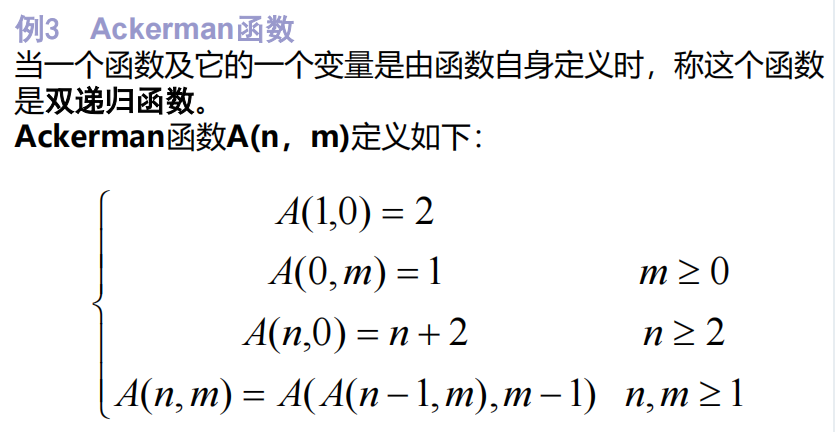


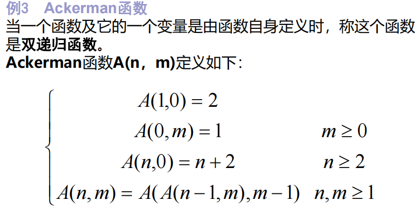
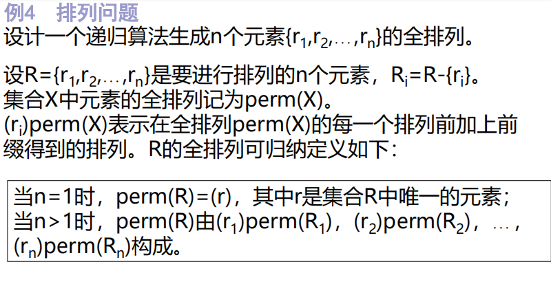
```C
template<class Type>
void Perm(Type list[], int k, int m )
    { //产生[list[k:m]的所有排列
    if(k==m)
        { //只剩下一个元素
        for (int i=0;i<=m;i++) 
        cout<<list[i];
        cout<<endl;
        }
    else //还有多个元素待排列，递归产生排列
        for (int i=k; i<=m; i++)
        {
        swap(list[k],list[i]);
        Perm(list,k+1,m); 
        swap(list[k],list[i]); 
     } 
}
```
<div style="border: 2px solid black; display: inline-block; padding: 10px;">
  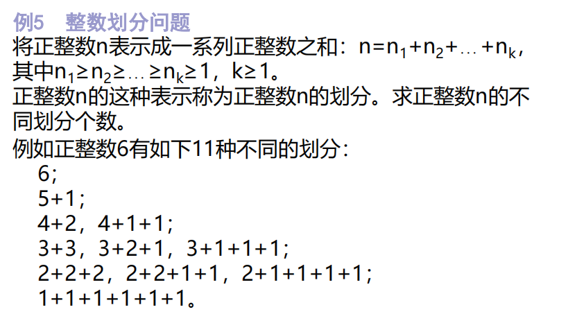
  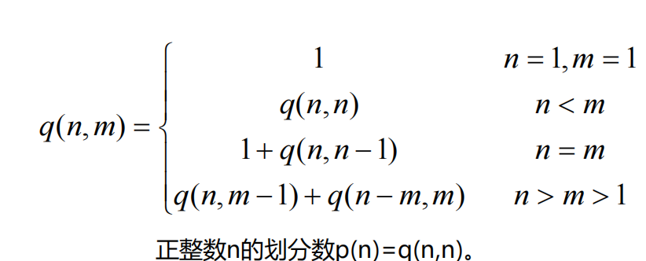
</div>
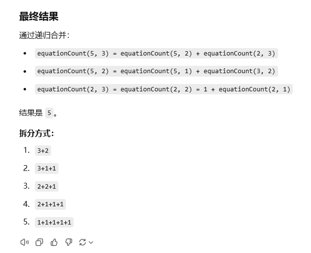
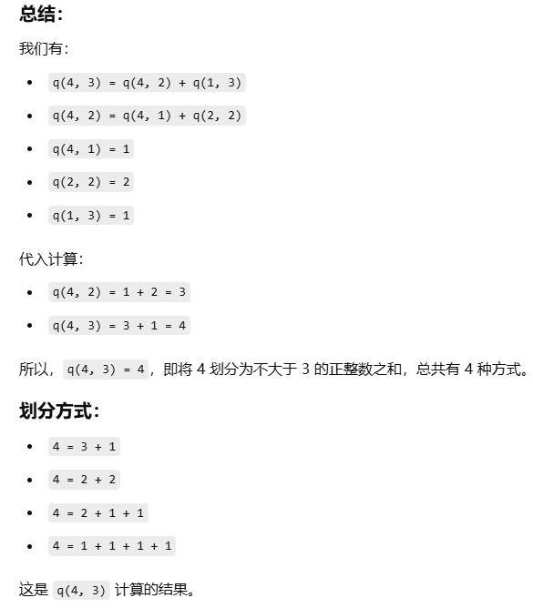

```C
int equationCount(int n,int m)
{
    if(n<1||m<1)
        return 0;
    if(n==1||m==1)
        return 1;
    else if(n<m)
        return equationCount(n,n);
    else if(n==m)
        return 1+equationCount(n,n-1);
    else
        return equationCount(n,m-1)+equationCount(n-m,m);
}
```


```C
void hanoi(int n,int a,int b ,int c)
{
    if(n>0)
    {
        hanoi(n-1,z,c,b);
        move(a,b);
        hanoi(n-1,c,b,a);
    }
}
```
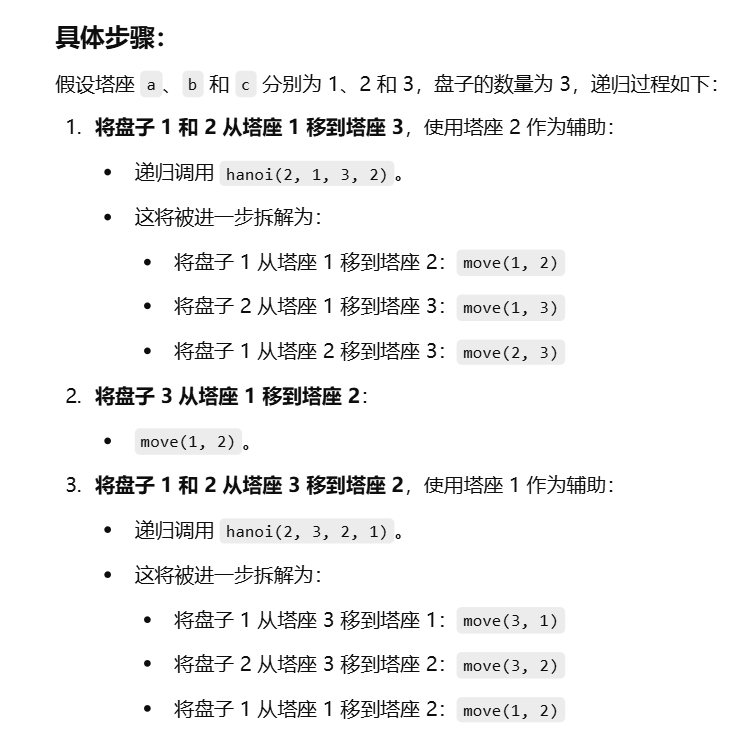
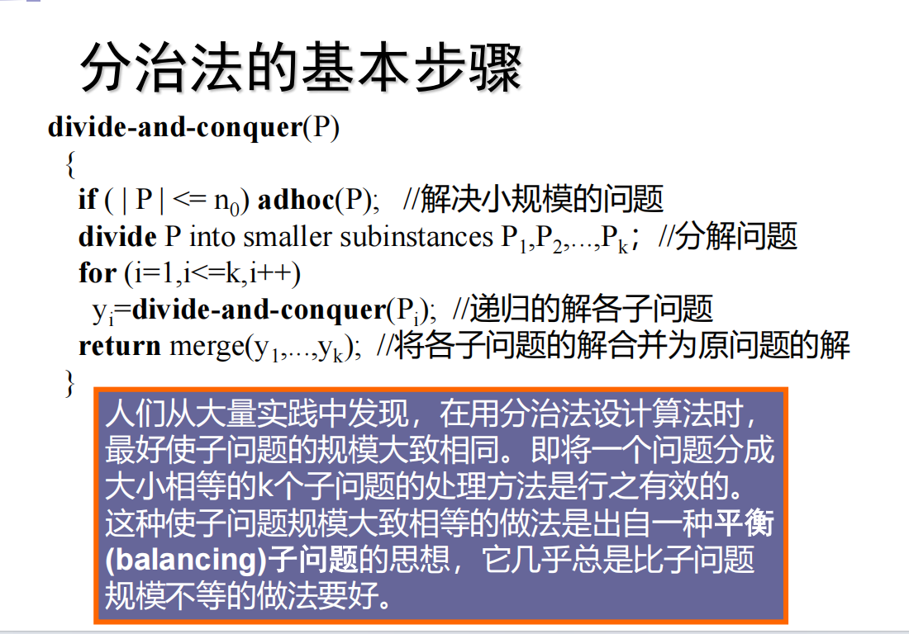
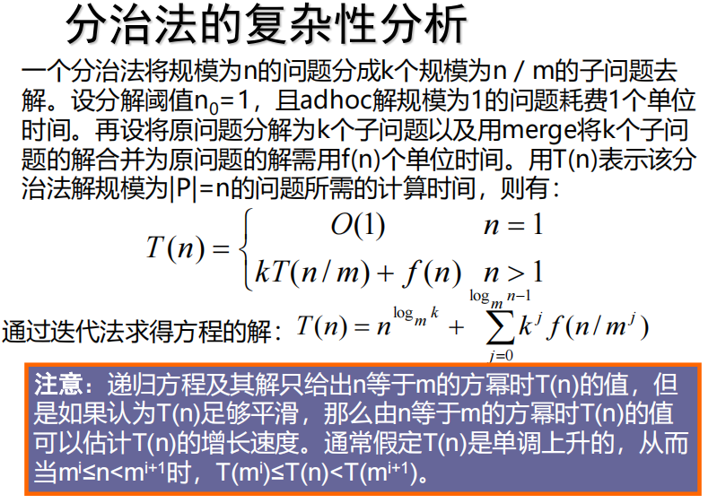
**二分搜索算法：**
```C
template<class Type> 
int BinarySearch(Type a[], const Type& x, int l, int r)
{
    while (r >= l)
    { 
        int m = (l+r)/2;
        if (x == a[m]) return m;
        if (x < a[m]) r = m-1; else l = m+1;
    }
return -1;
}
```
# **第三章**
通过应用范例学习动态规划算法设计策略。
```
① 矩阵连乘问题；
② 最长公共子序列；
③ 最大子段和
④ 凸多边形最优三角剖分；
⑤ 多边形游戏；
⑥ 电路布线；
⑦ 流水作业调度；
⑧ 0-1背包问题；
⑨ 最优二叉搜索树  
```
# **复习**
  **编程或算法实现重点在：最大字段和，最优装载、0-1背包问题、最长公共子序列、活动安排问题、棋盘覆盖、多边形游戏 （1）活动安排问题；（2）最优装载问题；（3）单源最短路径；（4）最小生成树；**

## 棋盘覆盖
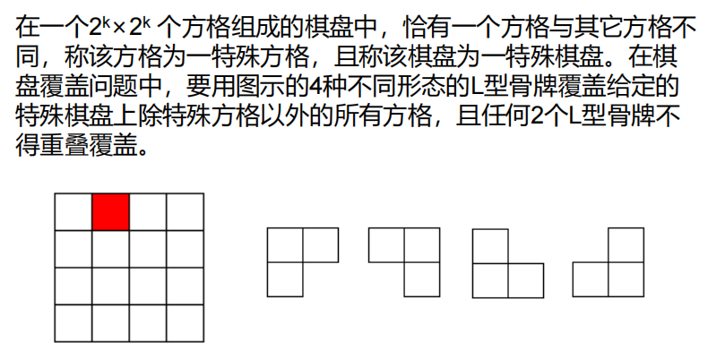
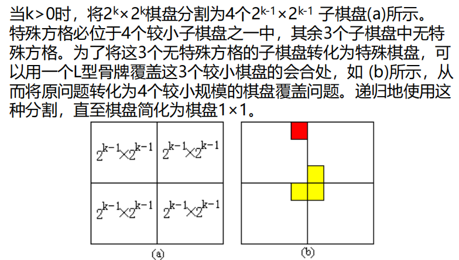
```C
void chessBoard(int tr, int tc, int dr, int dc, int size) 
{
    // tr, tc 为棋盘左上角方格的行列号
    // dr, dc 为特殊方格的位置（行号、列号）
    // size 为当前棋盘的大小

    // 基本情况：当棋盘的大小为1时，不再进行分割，直接返回
    if (size == 1) return;

    // 定义一个 L 型骨牌编号 t，和棋盘分割的大小 s
    int t = tile++,  // 使用递增的 t 值作为 L 型骨牌编号
        s = size / 2;  // 分割棋盘，将棋盘分成 4 个子棋盘

    // 覆盖左上角的子棋盘
    if (dr < tr + s && dc < tc + s)
        // 如果特殊方格在左上角的子棋盘中
        chessBoard(tr, tc, dr, dc, s);  // 递归处理左上角子棋盘
    else {
        // 如果特殊方格不在左上角子棋盘中
        board[tr + s - 1][tc + s - 1] = t;  // 使用 t 号 L 型骨牌覆盖左下角的特殊方格
        // 递归覆盖其他区域
        chessBoard(tr, tc, tr + s - 1, tc + s - 1, s);
    }

    // 覆盖右上角的子棋盘
    if (dr < tr + s && dc >= tc + s)
        // 如果特殊方格在右上角的子棋盘中
        chessBoard(tr, tc + s, dr, dc, s);  // 递归处理右上角子棋盘
    else {
        // 如果特殊方格不在右上角子棋盘中
        board[tr + s - 1][tc + s] = t;  // 使用 t 号 L 型骨牌覆盖右上角的特殊方格
        // 递归覆盖其他区域
        chessBoard(tr, tc + s, tr + s - 1, tc + s, s);
    }

    // 覆盖左下角的子棋盘
    if (dr >= tr + s && dc < tc + s)
        // 如果特殊方格在左下角的子棋盘中
        chessBoard(tr + s, tc, dr, dc, s);  // 递归处理左下角子棋盘
    else {
        // 如果特殊方格不在左下角子棋盘中
        board[tr + s][tc + s - 1] = t;  // 使用 t 号 L 型骨牌覆盖左下角的特殊方格
        // 递归覆盖其他区域
        chessBoard(tr + s, tc, tr + s, tc + s - 1, s);
    }

    // 覆盖右下角的子棋盘
    if (dr >= tr + s && dc >= tc + s)
        // 如果特殊方格在右下角的子棋盘中
        chessBoard(tr + s, tc + s, dr, dc, s);  // 递归处理右下角子棋盘
    else {
        // 如果特殊方格不在右下角子棋盘中
        board[tr + s][tc + s] = t;  // 使用 t 号 L 型骨牌覆盖右下角的特殊方格
        // 递归覆盖其他区域
        chessBoard(tr + s, tc + s, tr + s, tc + s, s);
    }
}
```
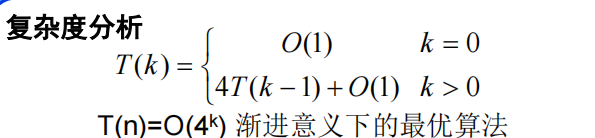
## 最长公共子序列
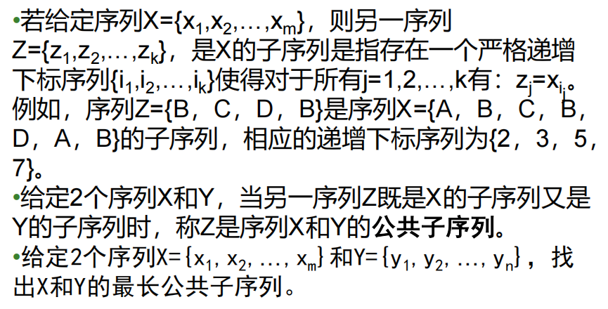
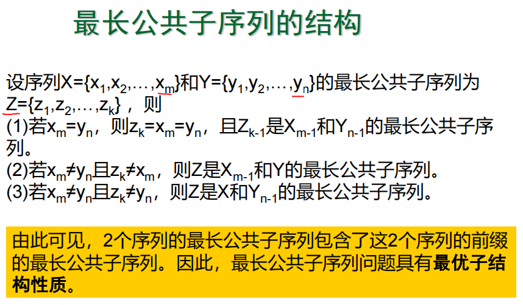
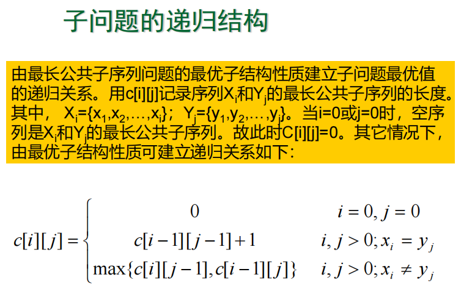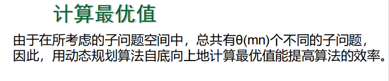
```C
void chessBoard(int tr, int tc, int dr, int dc, int size) 
{
    // tr, tc 为棋盘左上角方格的行列号
    // dr, dc 为特殊方格的位置（行号、列号）
    // size 为当前棋盘的大小

    // 基本情况：当棋盘的大小为1时，不再进行分割，直接返回
    if (size == 1) return;

    // 定义一个 L 型骨牌编号 t，和棋盘分割的大小 s
    int t = tile++,  // 使用递增的 t 值作为 L 型骨牌编号
        s = size / 2;  // 分割棋盘，将棋盘分成 4 个子棋盘

    // 覆盖左上角的子棋盘
    if (dr < tr + s && dc < tc + s)
        // 如果特殊方格在左上角的子棋盘中
        chessBoard(tr, tc, dr, dc, s);  // 递归处理左上角子棋盘
    else {
        // 如果特殊方格不在左上角子棋盘中
        board[tr + s - 1][tc + s - 1] = t;  // 使用 t 号 L 型骨牌覆盖左下角的特殊方格
        // 递归覆盖其他区域
        chessBoard(tr, tc, tr + s - 1, tc + s - 1, s);
    }

    // 覆盖右上角的子棋盘
    if (dr < tr + s && dc >= tc + s)
        // 如果特殊方格在右上角的子棋盘中
        chessBoard(tr, tc + s, dr, dc, s);  // 递归处理右上角子棋盘
    else {
        // 如果特殊方格不在右上角子棋盘中
        board[tr + s - 1][tc + s] = t;  // 使用 t 号 L 型骨牌覆盖右上角的特殊方格
        // 递归覆盖其他区域
        chessBoard(tr, tc + s, tr + s - 1, tc + s, s);
    }

    // 覆盖左下角的子棋盘
    if (dr >= tr + s && dc < tc + s)
        // 如果特殊方格在左下角的子棋盘中
        chessBoard(tr + s, tc, dr, dc, s);  // 递归处理左下角子棋盘
    else {
        // 如果特殊方格不在左下角子棋盘中
        board[tr + s][tc + s - 1] = t;  // 使用 t 号 L 型骨牌覆盖左下角的特殊方格
        // 递归覆盖其他区域
        chessBoard(tr + s, tc, tr + s, tc + s - 1, s);
    }

    // 覆盖右下角的子棋盘
    if (dr >= tr + s && dc >= tc + s)
        // 如果特殊方格在右下角的子棋盘中
        chessBoard(tr + s, tc + s, dr, dc, s);  // 递归处理右下角子棋盘
    else {
        // 如果特殊方格不在右下角子棋盘中
        board[tr + s][tc + s] = t;  // 使用 t 号 L 型骨牌覆盖右下角的特殊方格
        // 递归覆盖其他区域
        chessBoard(tr + s, tc + s, tr + s, tc + s, s);
    }
}

```
## 多边形游戏
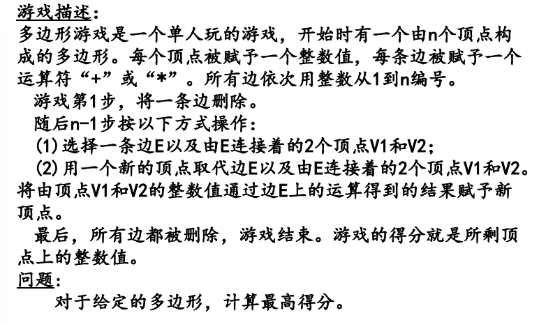
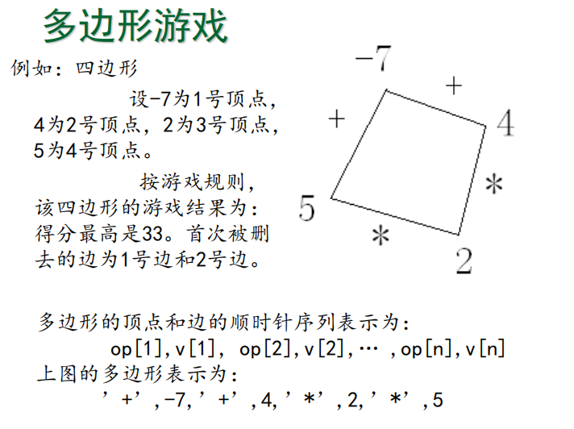
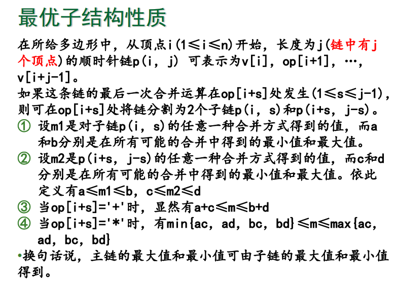
构造递归函数
由上分析可知，为了求链合并的最大值，必须同时求子链合并的最大值和最小值。因此，在整个计算过程中，应同时计算最大值和最小值。

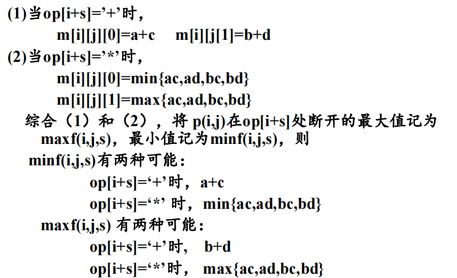
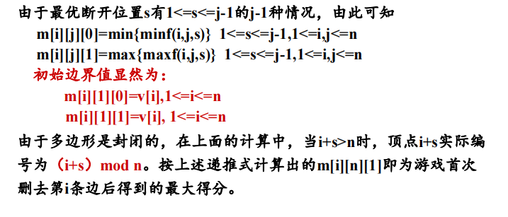
```C
void Min_Max(int n, int i, int s, int j, int &minf, int &maxf, int m[][n][2], char op[]) {
    int e[4];  // 用于存储不同计算的临时结果
    
    // 计算顶点 r
    int r = (i + s - 1) % n + 1;
    
    // 获取 p(i, s) 和 p(i+s, j-s) 的结果
    int a = m[i][s][0], b = m[i][s][1];   // p(i, s)
    int c = m[r][j - s][0], d = m[r][j - s][1]; // p(i+s, j-s)
    
    // 判断当前操作符是加法还是乘法
    if (op[r] == '+') {
        // 如果是加法，直接将最小值和最大值相加
        minf = a + c;
        maxf = b + d;
    } else {
        // 如果是乘法，计算可能的乘法结果
        e[1] = a * c;
        e[2] = a * d;
        e[3] = b * c;
        e[4] = b * d;

        // 初始化 minf 和 maxf 为 e[1]（即 a * c）
        minf = maxf = e[1];
        
        // 遍历剩余的计算结果，更新 minf 和 maxf
        for (int r = 2; r < 5; r++) {
            if (minf > e[r]) minf = e[r]; // 更新最小值
            if (maxf < e[r]) maxf = e[r]; // 更新最大值
        }
    }
}
```

```C
int Poly_Max(int n) {
    int minf, maxf;

    // 遍历所有可能的链长度 j 和子链起始点 i
    for (int j = 2; j <= n; j++) {
        for (int i = 1; i <= n; i++) {
            for (int s = 1; s < j; s++) {
                // 计算链长为 j 的最小值和最大值
                Min_Max(n, i, s, j, minf, maxf, m, op);
                
                // 更新 m[i][j] 的最小值和最大值
                if (m[i][j][0] > minf) m[i][j][0] = minf;
                if (m[i][j][1] < maxf) m[i][j][1] = maxf;
            }
        }
    }

    // 找到从顶点 1 开始的最大值
    int temp = m[1][n][1];
    for (int i = 1; i <= n; i++) {
        if (temp < m[i][n][1]) temp = m[i][n][1];
    }

    return temp;
}
```
## 0-1背包问题
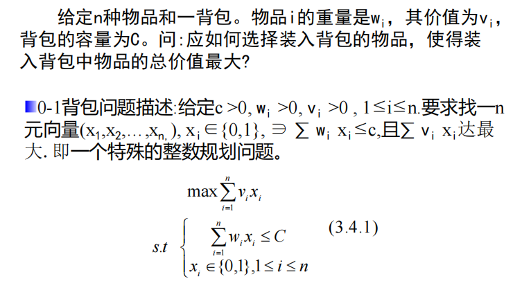
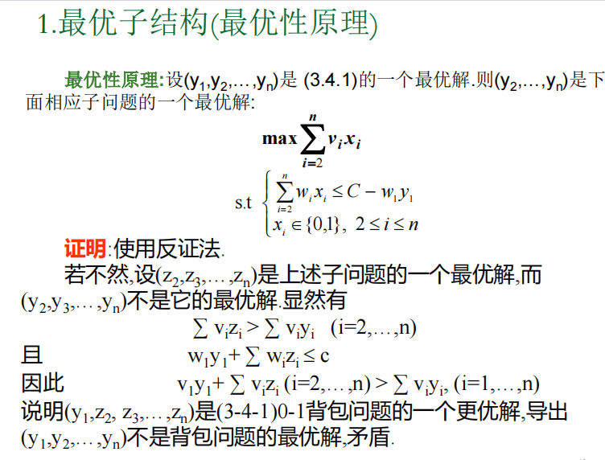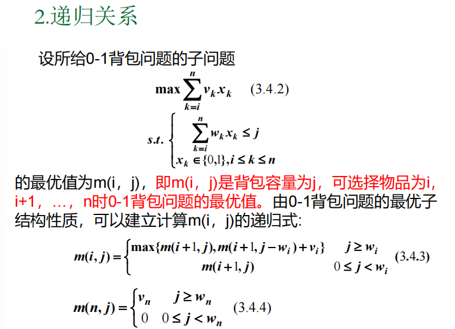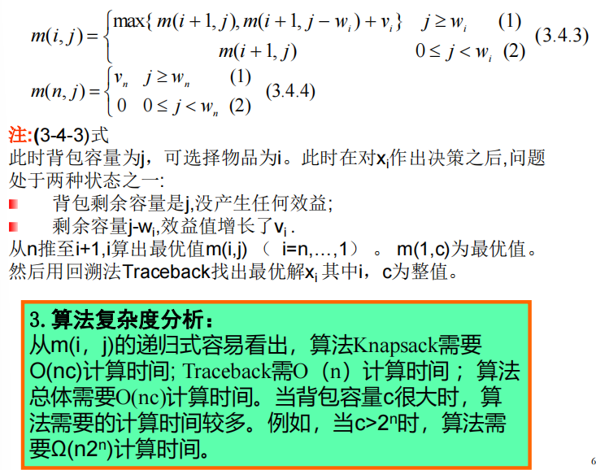
```C
// 0/1 背包问题的动态规划解法

template< class Type >
void Knapsack(Type *v, int *w, int c, int n, Type **m) {
    // 计算背包剩余容量的最大值，确保 j <= jMax < c
    int jMax = min(w[n] - 1, c);
    
    // 初始化背包容量小于第n个物品重量时，背包中不能装下该物品
    for (int j = 0; j <= jMax; j++)  
        m[n][j] = 0;
    
    // 对于背包容量大于等于第n个物品重量时，背包的价值等于该物品的价值
    for (int j = w[n]; j <= c; j++)  
        m[n][j] = v[n];
    
    // 从第n-1个物品开始逐步更新最大价值
    for (int i = n - 1; i > 1; i--) {
        jMax = min(w[i] - 1, c);  // 背包容量小于当前物品重量时，不能选择该物品
        for (int j = 0; j <= jMax; j++)  // 背包容量小于第i个物品重量时，背包的最大价值等于不选第i个物品的价值
            m[i][j] = m[i + 1][j];
        
        for (int j = w[i]; j <= c; j++) {  // 背包容量大于等于物品重量时，可以选择该物品
            // 选择当前物品与否，更新最大价值
            m[i][j] = max(m[i + 1][j], m[i + 1][j - w[i]] + v[i]);
        }
    }
    
    // 最后处理第1个物品
    m[1][c] = m[2][c];
    if (c >= w[1])
        m[1][c] = max(m[1][c], m[2][c - w[1]] + v[1]);
}

// 回溯函数，用于追踪最优解中哪些物品被选中
template <class Type>
void Traceback(Type **m, int *w, int c, int n, int x[]) {
    // 从第1个物品开始回溯，逐一确定物品是否被选中
    for (int i = 1; i < n; i++) {
        // 如果当前背包容量没有改变，则第i个物品没有被选中
        if (m[i][c] == m[i + 1][c])  
            x[i] = 0;  // 物品i没有被选中
        else {  // 如果背包容量改变了，则第i个物品被选中
            x[i] = 1;  // 物品i被选中
            c = c - w[i];  // 更新背包剩余容量
        }
    }
    
    // 最后处理第n个物品的选择情况
    x[n] = (m[n][c]) ? 1 : 0;  // 如果m[n][c]不为0，则表示第n个物品被选中
}

```
## 装载问题
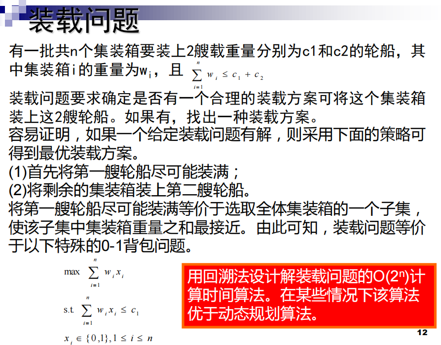
```C
// 模板类，用于处理任意类型的数据（如整型、浮点型）
template <class Type>
class Loading
{
    // 声明友元函数，方便直接访问私有成员
    friend Type MaxLoading(Type w[], Type c, int n);
private:
    // 回溯函数，用于递归搜索
    void Backtrack(int i);
    // 集装箱数量
    int n;
    // 指向集装箱重量数组的指针
    Type *w;
    // 容器最大承重量
    Type c;
    // 当前装载重量（已经选择的集装箱总重量）
    Type cw;
    // 当前找到的最大装载重量
    Type bestw;
    // 剩余未考察的集装箱总重量
    Type r;
};
// 回溯函数的实现
template <class Type>
void Loading<Type>::Backtrack(int i)
{
    // 如果当前已考察完所有的集装箱（递归结束条件）
    if (i > n)
    {
        // 如果当前装载重量超过已有最大值，更新最优解
        if (cw > bestw)
            bestw = cw;
        return; // 返回上一层
    }
    // 减去当前集装箱重量，更新剩余未考察重量
    r -= w[i];
    // 尝试选中当前集装箱（左子树搜索）
    if (cw + w[i] <= c) // 如果选择当前集装箱不会超出容器容量
    {
        cw += w[i]; // 更新当前装载重量
        Backtrack(i + 1); // 递归考察下一个集装箱
        cw -= w[i]; // 回溯：撤销选择当前集装箱
    }
    // 尝试不选当前集装箱（右子树搜索）
    if (cw + r > bestw) // 剪枝条件：剩余重量有可能超过当前最优值
    {
        Backtrack(i + 1); // 递归考察下一个集装箱
    }
    // 回溯：恢复剩余未考察重量
    r += w[i];
}
// 最大装载重量的入口函数
template <class Type>
Type MaxLoading(Type w[], Type c, int n)
{
    // 定义一个 Loading 类的对象
    Loading<Type> X;
    // 初始化成员变量
    X.w = w;       // 集装箱重量数组
    X.c = c;       // 容器最大承重量
    X.n = n;       // 集装箱数量
    X.bestw = 0;   // 最优解初始化为 0
    X.cw = 0;      // 当前装载重量初始化为 0
    X.r = 0;       // 剩余未考察重量初始化为 0
    // 计算所有集装箱的总重量（用于初始化剩余重量 r）
    for (int i = 1; i <= n; i++)
        X.r += w[i];
    // 调用回溯函数，从第一个集装箱开始
    X.Backtrack(1);
    // 返回找到的最大装载重量
    return X.bestw;
}

```
