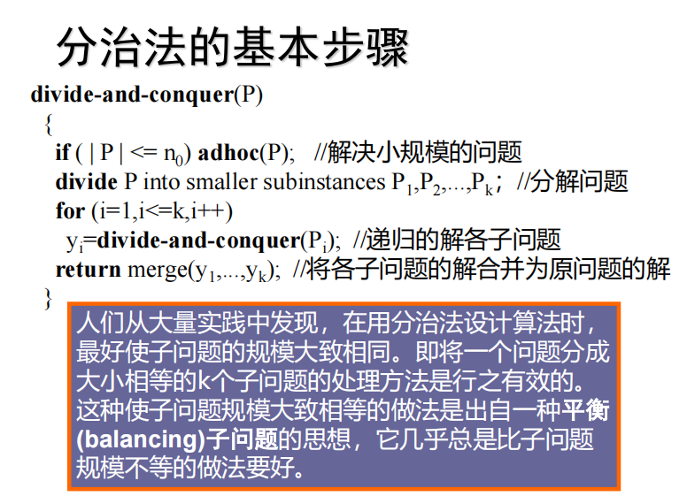

# 第一章
例. 求正整数m、n的最大公因数。
```C
Euclid(int m, int n)
{ int r;
while(n!=0)
{ r=m%n;
m=n;
n=r;
}
printf(“%d”, m)
}
```
（5）模板template ：
```C
template <class Type>
Type max(Type x,Type y)
{
return x>y?x:y;
} 
int i=max(1,2)；
double x=max(1.0,2.0)；
```
例：顺序搜索算法
```C
template<class Type>
int seqSearch(Type *a, int n, Type k)
{
for(int i=0;i<n;i++)
if (a[i]==k) return i;
return -1;
}
```
递归算法复杂性分析
```C
int factorial(int n)
{
 if (n == 0) return 1; 
 return n*factorial(n-1);
}
```
.png)
# **第2章 递归与分治策略**
通过实例学习分治策略设计技巧。 
```  
（1）二分搜索技术
（2）大整数乘法
（3）Strassen矩阵乘法
（4）棋盘覆盖
（5）合并排序和快速排序
（6）线性时间选择
（7）最接近点对问题
（8）循环赛日程表
```
第n个Fibonacci数可递归地计算如下：
```C
int fibonacci(int n)
{
if (n <= 1) return 1;
return fibonacci(n-1)+fibonacci(n-2);
}
```


```C
template<class Type>
void Perm(Type list[], int k, int m )
    { //产生[list[k:m]的所有排列
    if(k==m)
        { //只剩下一个元素
        for (int i=0;i<=m;i++) 
        cout<<list[i];
        cout<<endl;
        }
    else //还有多个元素待排列，递归产生排列
        for (int i=k; i<=m; i++)
        {
        swap(list[k],list[i]);
        Perm(list,k+1,m); 
        swap(list[k],list[i]); 
     } 
}
```


```C
int equationCount(int n,int m)
{
    if(n<1||m<1)
        return 0;
    if(n==1||m==1)
        return 1;
    else if(n<m)
        return equationCount(n,n);
    else if(n==m)
        return 1+equationCount(n,n-1);
    else
        return equationCount(n,m-1)+equationCount(n-m,m);
}
```

```C
void hanoi(int n,int a,int b ,int c)
{
    if(n>0)
    {
        hanoi(n-1,z,c,b);
        move(a,b);
        hanoi(n-1,c,b,a);
    }
}

```


**二分搜索算法：**
```C
template<class Type> 
int BinarySearch(Type a[], const Type& x, int l, int r)
{
    while (r >= l)
    { 
        int m = (l+r)/2;
        if (x == a[m]) return m;
        if (x < a[m]) r = m-1; else l = m+1;
    }
return -1;
}
```
# **第三章**
通过应用范例学习动态规划算法设计策略。
```
① 矩阵连乘问题；
② 最长公共子序列；
③ 最大子段和
④ 凸多边形最优三角剖分；
⑤ 多边形游戏；
⑥ 电路布线；
⑦ 流水作业调度；
⑧ 0-1背包问题；
⑨ 最优二叉搜索树  
```
